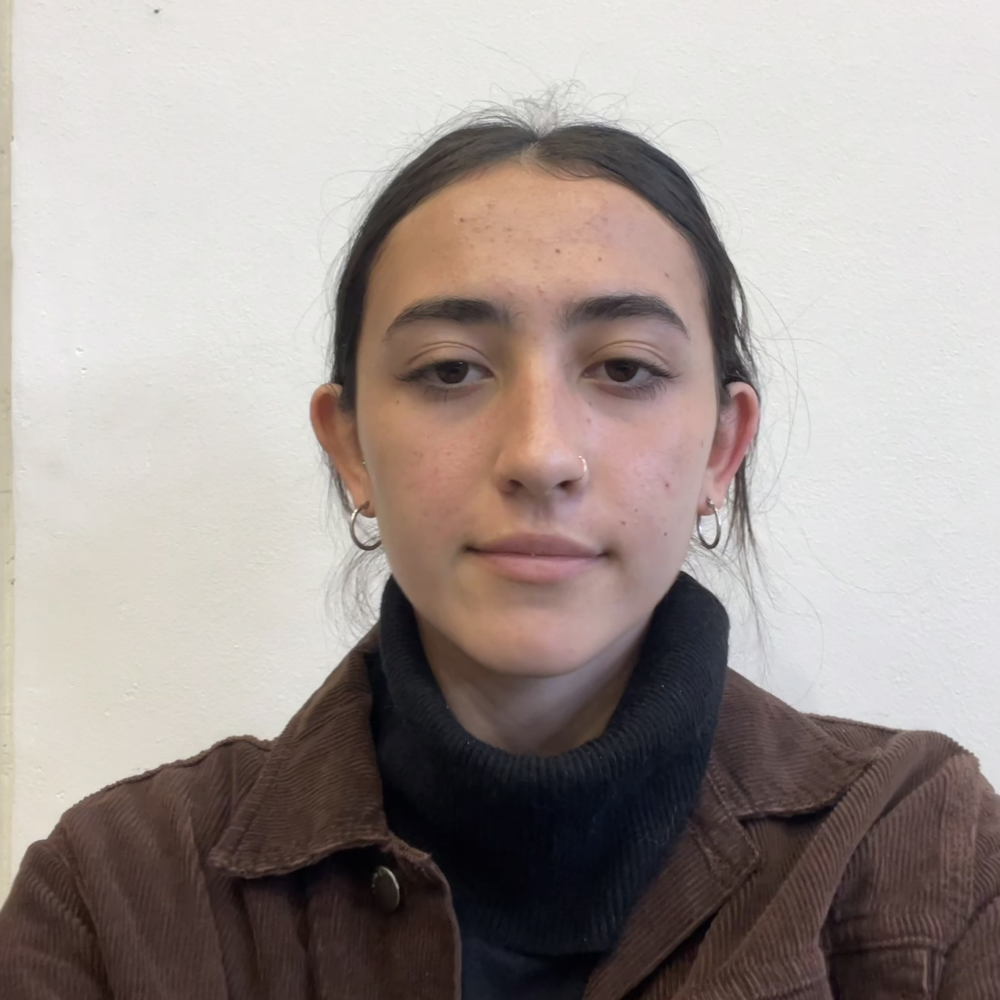
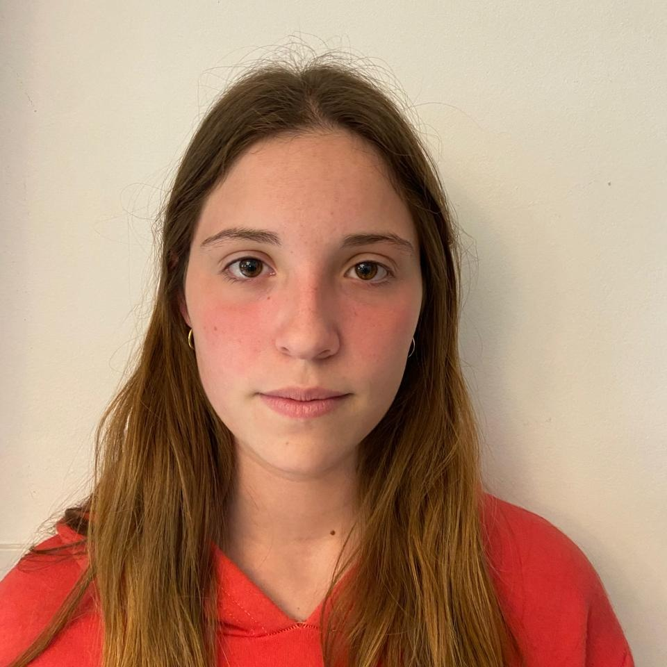

# 💻 Las Pilas

> **Programación II** · Jueves turno tarde · 2026

---

## 👥 Equipo

<table align="center">
  <tr>
    <td align="center">
       
      <b>Santiago Flotta Castro</b> 
      Legajo: 1494154
    </td>
    <td align="center">
       
      <b>Rocío Miñones</b> 
      Legajo: 1215772
    </td>
    <td align="center">
       
      <b>Dolores Ortiz</b> 
      Legajo: 1215275
    </td>
  </tr>
  <tr>
    <td align="center">
       
      <b>Fiamma Palgia</b> 
      Legajo: 1213802
    </td>
    <td align="center">
       
      <b>Florencia Ríos</b> 
      Legajo: 1214573
    </td>
    <td align="center">
       
      <b>Luciano Rossi</b> 
      Legajo: 1191790
    </td>
  </tr>
</table>

---

## 📚 Sobre el repositorio

Este repositorio contiene los trabajos prácticos y ejercicios de la materia **Programación II**, cursada en 2026.

---

## 🛠️ Tecnologías

